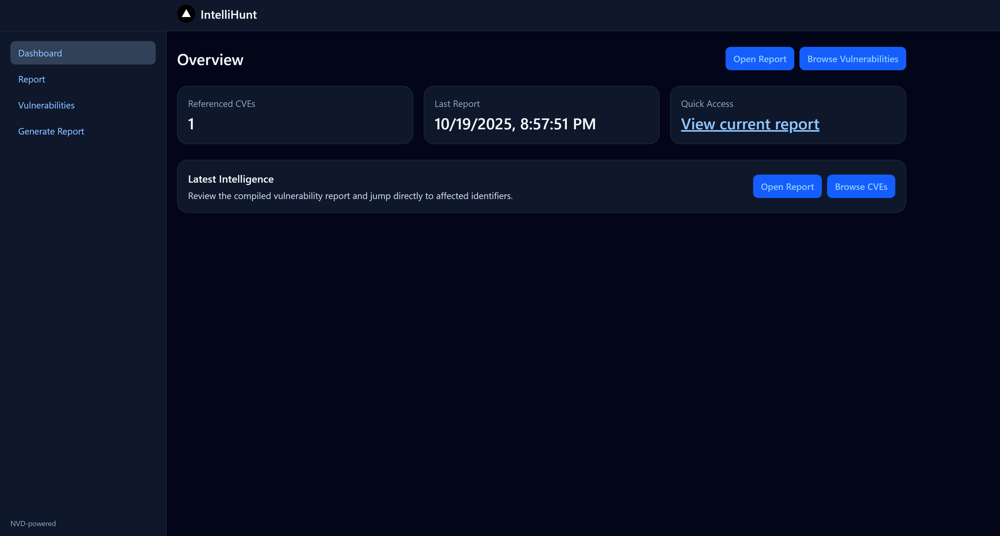
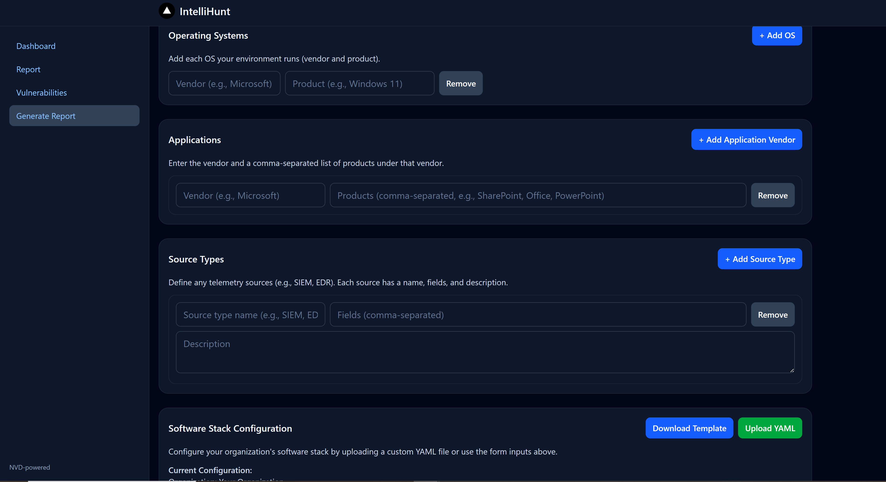
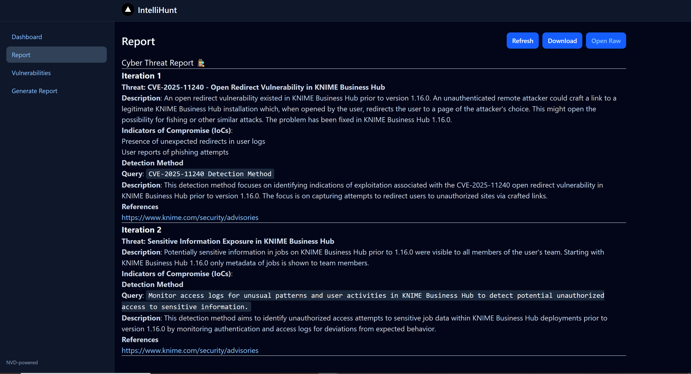
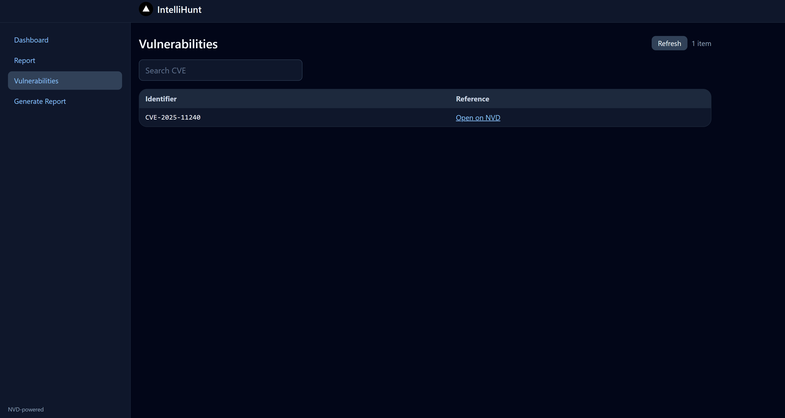

# intelliHunt

This repo contains a containerized application to conduct automated threat intelligence and threat hunting 
for cybersecurity. 

## To Run

#### docker-compose up --build

Application will be running on http://localhost:3000
Webpage should display generated report, static webpage

## Why and How

Cyber Threat Intelligence (CTI) can be an onerous process. One in which an analyst must spend hours combing through articles and databases to find threats relevant to their organizations software. This leaves little or maybe no time to strategize on mitigating the identified threats. Our application aims to alleviate a small portion of the pain faced by CTI and assist in the subsequent process of Cyber Threat Hunt (CTH).

intelliHunt is comprised of 2 main functions:
1. Programatically pull vulnerability data 
2. Utilize Agentic AI to enrich the vulnerability data and create initial threat hunting guidance

For the pull of vulnerability data we utilize the National Vulnerability Database (NVD) (https://nvd.nist.gov/). We plan to incorporate more sources in the future. The CPE's which are pulled depend on the user entered software stack. The front end accepts software stack information via text box input and/or yaml, a template yaml is provided. Inputs from both sources are collated prior to processing, allowing user to append information as they are comfortable with. When the report generation is kicked off, this software stack information is used to pull data from NVD for CPE's then CVE's. This gets us our relevant vulnerabilities.

Next, the vulnerability information is passed to our agentic pipeline. For orchestration of our agents we use CrewAI (https://www.crewai.com/). The example.env file contains information on how to setup your env to specify provider, model, and api keys. Currently supported are OpenAI and Groq, but, local inference  is something that will be added (probably via Ollama but what you guys think?). The agents utilize the vulnerabilities, associates urls returned from NVD, as well as general web search if needed, to gather information on the vulnerability and generate a report entry. The gathered information is also used to generate an example splunk query (via Agent) to search for that vulnerability being exploited on the users network. Future work should incorporate alternative methods of search as well.  

All this runs within 2 docker containers, so you can spin up and use within your environment. 

## The application has pages to upload software stack (manually or through a yaml) and view the retrieved information and report

### home page

### report generation

### report viewer

### vulnerability information
