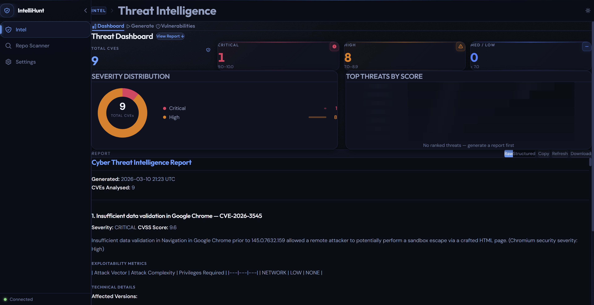
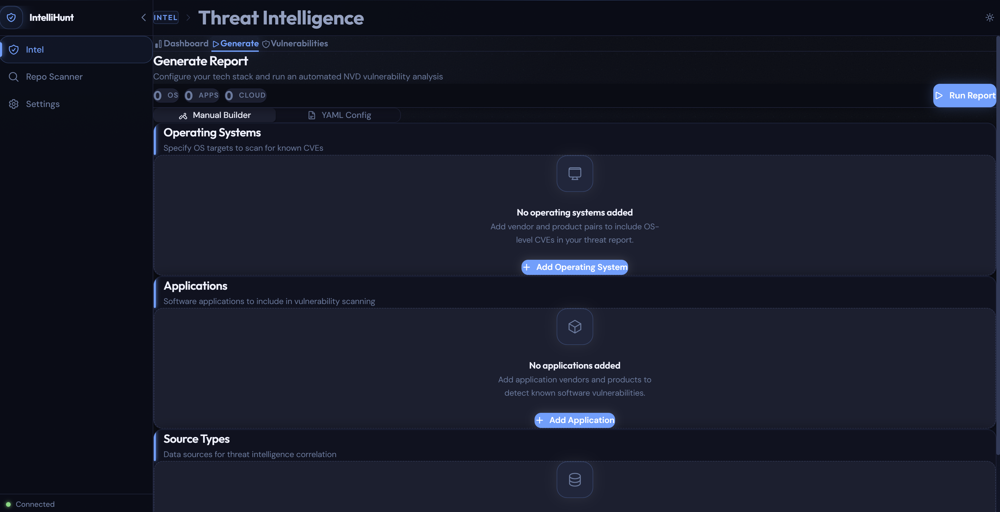
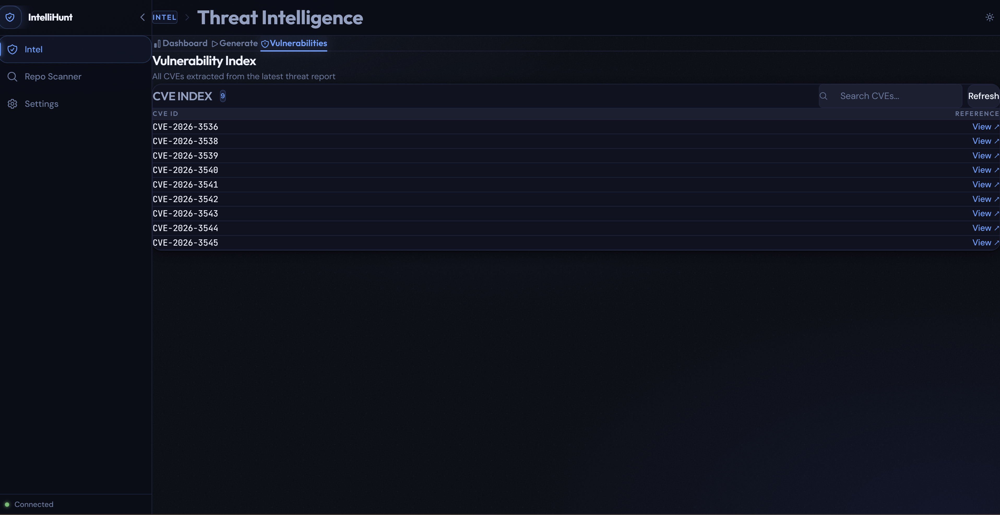
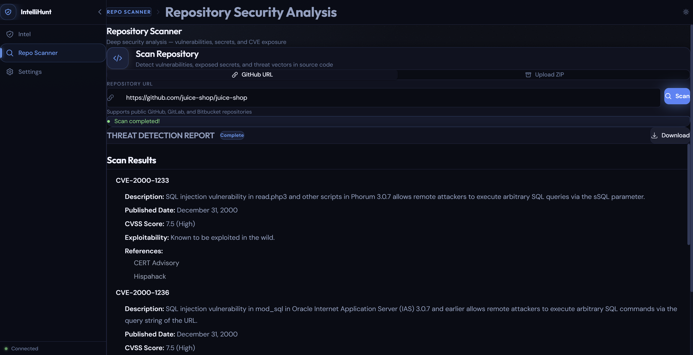
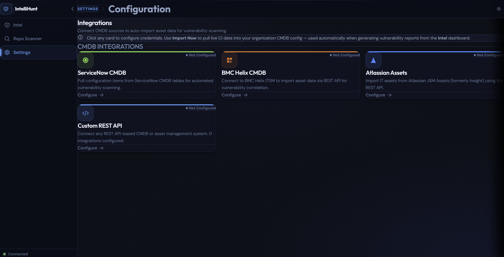

# intelliHunt

**IntelliHunt** is a containerized, AI-driven platform designed to automate the heavy lifting of Cyber Threat Intelligence (CTI) and Threat Hunting (CTH). By correlating organizational software stacks with real-time vulnerability data and utilizing an autonomous agentic pipeline, IntelliHunt transforms raw data into actionable hunting strategies.

---

## Key Features

* **Automated Data Aggregation:** Programmatically pulls vulnerability data from the National Vulnerability Database (NVD) based on specific Common Platform Enumerations (CPEs).
* **Agentic AI Enrichment:** Leverages [CrewAI](https://www.crewai.com/) to orchestrate intelligent agents that research CVEs, analyze associated URLs, and perform web searches to contextualize threats.
* **Automated Hunting Queries:** Generates organization-specific Splunk queries (with more SIEM integrations planned) to detect exploitation attempts within your network.
* **Flexible Input:** Supports software stack definitions via manual text input or YAML configuration files.

---

## Getting Started

### Prerequisites
* Docker and Docker Compose
* An API Key for a supported LLM provider (OpenAI or Groq)

### Installation & Deployment
1.  **Configure Environment:**
    Rename `example.env` to `.env` and populate it with your provider, model selection, and API keys.
2.  **Launch the Containers:**
    ```bash
    docker-compose up --build
    ```
3.  **Access the Interface:**
    Navigate to `http://localhost:3000` in your web browser.

---

## Feature Deep Dive

### Repository Scanner
The **Repo Scanner** endpoint provides a proactive way to assess your attack surface by analyzing source code environments. This feature allows users to identify the software stack automatically without manual entry.

* **GitHub Integration:** Provide a public or private GitHub repository URL to trigger a scan.
* **Compressed Uploads:** Upload `.zip` or `.tar.gz` archives of local repositories.
* **Automated CPE Mapping:** The scanner parses dependency files (e.g., `requirements.txt`, `package.json`, `pom.xml`) to identify software versions and map them to relevant CPEs for vulnerability tracking.

### The Agentic Pipeline
IntelliHunt doesn't just list vulnerabilities; it investigates them. Our agents:
1.  **Analyze** the vulnerability impact relative to your specific stack.
2.  **Research** secondary sources and technical blogs for exploit patterns.
3.  **Synthesize** a comprehensive report entry including mitigation steps and detection logic.

---

## User Interface

### Home Page


### Report Generation


### Vulnerability Information


### Repo Scanner


### Settings


---

## Roadmap
* **Local Inference:** Support for Local Models to ensure data privacy.
* **Expanded Data Sources:** Integration with OSINT feeds and ISAC databases.
* **Advanced Detection Logic:** Support for Sigma rules and KQL (Microsoft Sentinel).